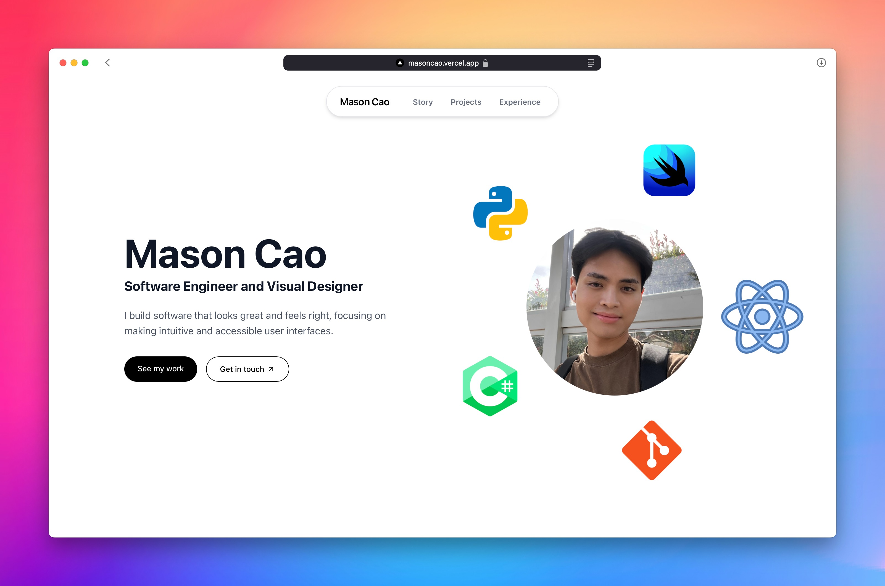

# 👨‍💻 Mason Cao Portfolio Website

A modern, responsive portfolio website built with Next.js, and deployed on Vercel.



## 🚀 Live Website

Check out the live version of the portfolio: [masoncao.vercel.app](https://masoncao.vercel.app)

## ✨ Features

- **Responsive Design**: Optimized for all screen sizes
  - Desktop: Full layout with side-by-side sections
  - Mobile: Stacked layout with optimized typography and margins, prioritising touch-friendly navigation
- **Smooth Scrolling Navigation**: Seamless transitions between sections, vertical or horizontal
- **Animated UI Components**: Subtle animations for enhanced user experience
- **Accessibility-Focused**: Built with accessibility in mind

## 🛠️ Tech Stack

- **Frontend**: Next.js, React, Tailwind CSS
- **Deployment**: GitHub repository connected to Vercel

## 📋 Project Structure

```
/
├── app/
│   ├── globals.css
│   ├── layout.tsx
│   └── page.tsx
├── components/           # React components
│   ├── layout/           # Layout components
│   │   ├── Header.tsx    # Site header
│   │   └── Portfolio.tsx # Main portfolio layout
│   ├── sections/         # Page sections
│   │   ├── HeroSection.tsx
│   │   ├── StorySection.tsx
│   │   ├── ProjectSection.tsx
│   │   ├── ExperienceSection.tsx
│   │   └── ContactSection.tsx
│   └── ui/               # Reusable UI components
│       ├── AnimatedProfile.tsx
│       ├── ProjectCard.tsx
│       ├── ProjectModal.tsx
│       └── SkillIcon.tsx
├── data/
│   └── content.ts        # Portfolio content
├── public/               # Static image/icon assets
│   └── assets/
└── ...                   # Config files
```

## 🚀 Getting Started

### Prerequisites

- Node.js (v14 or later)
- npm

### Installation

1. Clone the repository:

   ```bash
   git clone https://github.com/masoncao/portfolio-website.git
   cd portfolio-website
   ```

2. Install dependencies:

   ```bash
   npm install
   ```

3. Run the development server:

   ```bash
   npm run dev
   ```

4. Open [http://localhost:3000](http://localhost:3000) in your browser to see the website.

## 🎨 Design Principles

This portfolio follows these core design principles:

- **Visual Hierarchy**: Clearly conveying the order of importance
- **Contrast**: Making key elements pop while maintaining readability
- **Balance**: Consistent spacing and alignment for all components
- **Simplicity**: Easy navigation and clear information architecture
- **Feedback**: Interactive elements provide clear feedback on user actions, e.g. the navigation bar highlights the active section as the user scrolls through the page.

## 🔄 Planned future enhancements

- Further customisation within the project card modal (headings, bold text, and hyperlinks)
- Additional project details and case studies

---

❤️ Mason Cao © 2025
